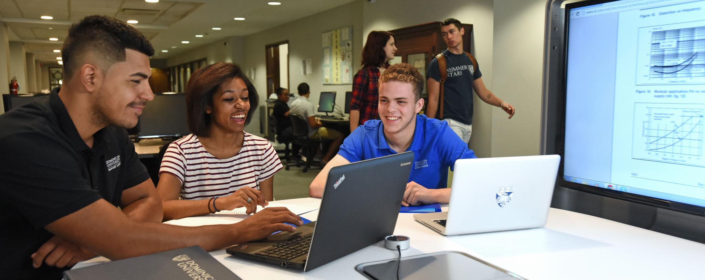

 

      

 <section>
    
    </section>
      

        

          <h1 class="display-3">Need a study spot?</h1>
          
Whether you're looking for a quiet space for one or a collaboration table for your group, we have you covered!

          
<a class="btn btn-primary btn-lg" href="#" role="button">Book a Room &raquo;</a>

        

      

      

          <h2 class="display-3">Study Areas</h2>
          
Explore our study room options, view room details and check availability

 

  

    

      <a href="#">
        
        

          
Computer Lab

        

      </a>
    

  

  

    

      <a href="#">
        
        

          
Study Lounge

        

      </a>
    

  

  

    

      <a href="#">
        
        

          
Collaboration Room

        

      </a>
    

  

   

   

      <a href="#">
        
        

          
Computer Lab

        

      </a>
    

  

  

    

      <a href="#">
        
        

          
Study Lounge

        

      </a>
    

  

  

    

      <a href="#">
        
        

          
Collaboration Room

        

      </a>
    

     

      

                <h2 class="display-3">News & Events</h2>
        

          

            <h2>Bio Study Group</h2>
            
Study and tackle challenging course concepts with the same group of peers for two hours each week. Receive guidance and support from a trained Study Group Facilitator who has already successfully completed the course.

            
<a class="btn btn-secondary" href="#" role="button">More &raquo;</a>

          

          

            <h2>Collab Room Open</h2>
            
Our newest collaboration room is now available for reservations. The room seats up to 10 people at 2 tables and includes a high-resolution projector, an 80” Sharp Aquos Board and Dell Optiplex PC.

            
<a class="btn btn-secondary" href="#" role="button">More &raquo;</a>

          

          

            <h2>Computer Lab</h2>
            
The first floor computer lab will be closed over Spring Break, March 5-10 for upgrades to computers, workstations and furnishings. Please check the online reservation center for open computer labs during this time.

            
<a class="btn btn-secondary" href="#" role="button">More &raquo;</a>

          

        

    

